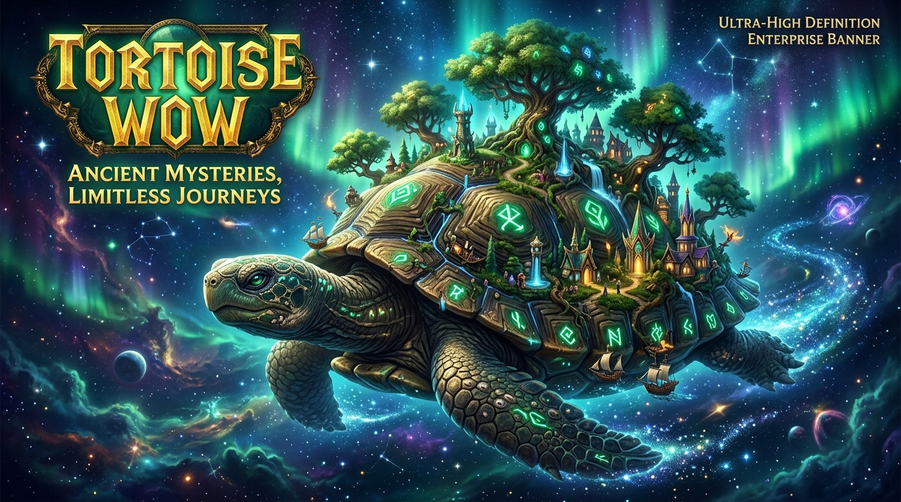
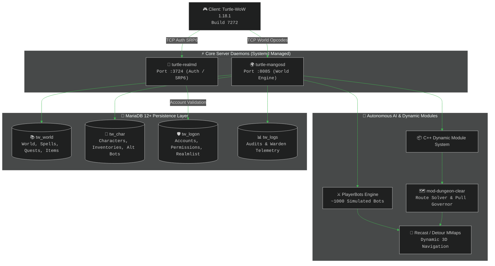

<div align="center">



# 🐢 TORTOISE-WOW

## Enterprise-Grade 1.18.1 CMaNGOS Core & Autonomous Playerbot Ecosystem

[](https://github.com/Shyalya/tortoise-wow)
[](https://github.com/ssdeanx/tortoise-wow)
[-58a6ff?style=for-the-badge&logo=warcraft&logoColor=white)](https://turtle-wow.org)
[](https://cmangos.net)
[](LICENSE)
[](./references/11_playerbot_suite.md)
[](./references/15_dungeon_clear_module.md)
[](https://mariadb.org)
[-238636?style=for-the-badge&logo=checkmarx&logoColor=white)](./gm_commands.md)

<p align="center">
  <a href="#-upstream-lineage--attribution">Upstream Origin</a> •
  <a href="#-about-this-fork">About This Fork</a> •
  <a href="#-architectural-topology--system-flow">Architecture</a> •
  <a href="#-autonomous-playerbot-ecosystem">Playerbots</a> •
  <a href="#-mod-dungeon-clear-ai-engine">Dungeon Clear</a> •
  <a href="#-modular-command-manuals--in-game-macros">Commands & Macros</a> •
  <a href="#-production-server-features">Server Features</a> •
  <a href="#-class-spell-item--data-fixes">Fixes</a> •
  <a href="#-quick-start--compilation">Quick Start</a> •
  <a href="#-enterprise-configuration-matrix">Configurations</a> •
  <a href="#-database-setup--migration-governance">Database</a> •
  <a href="#-acknowledgements--prior-authors">Credits</a>
</p>

---

</div>

> [!NOTE]
> **Project Compliance**: This project is an open-source educational restoration designed for non-profit private servers.
> **Target Version**: Turtle-WoW 1.18.1 build 7272.

---

## 🌟 Upstream Lineage & Attribution

> [!IMPORTANT]
> **Primary Upstream Source**: This codebase is directly derived from and built on the massive **100,000+ line** architectural overhaul and PlayerBots integration by **[Shyalya / tortoise-wow](https://github.com/Shyalya/tortoise-wow)** (incorporating work from **[r-o-sh/tortoise-wow](https://github.com/r-o-sh/tortoise-wow)**), based upon the foundational **[Penqle/tortoise-wow](https://github.com/Penqle/tortoise-wow)** repository. Full credit and sincere thanks to **Shyalya** for authoring the core stability fixes, memory leak resolutions, battleground sync, and dungeon fill systems that power this server.

---

## 🏛️ About this fork

A fork of **[Shyalya/tortoise-wow](https://github.com/Shyalya/tortoise-wow)** (and **[Penqle/tortoise-wow](https://github.com/Penqle/tortoise-wow)**) running a small private server with **~1000 playerbots** permanently online. Upstream is merged in periodically; everything below is what this fork adds on top.

**Playerbots are the foundation of this fork, not a side feature.** Upstream still lists them as planned; here they are what the server is built around, and running a thousand of them permanently is what shapes everything else. Load like that reaches code paths a few dozen players never touch — stale cached pointers, an unsynchronised battleground queue, navmesh tiles unloaded under a running query. Most of the fixes below started as something that went wrong in game and was traced back to its cause, which is why the commit messages read like bug reports rather than feature notes.

---

## 🏗️ Architectural Topology & System Flow



---

## 🤖 Autonomous Playerbot Ecosystem

Integrated from [r-o-sh's branch](https://github.com/r-o-sh/tortoise-wow/tree/playerbots-integration-gh), which vendors [ike3's playerbots][20] under `src/modules/PlayerBots/`. Build with `-DBUILD_PLAYERBOTS=ON`; activation is gated by `AiPlayerbot.Enabled`.

### 🛡️ Playerbot Engine Fixes & Enhancements

| Subsystem | Area Tag | Root Cause & Technical Resolution |
| :--- | :---: | :--- |
| **Battlegrounds** | [](./references/06_quests_instances_and_events.md) | Bots never queued, never entered, and dropped the flag on a PvP trinket. Three separate bugs, including a call to `HandleBattlefieldPortOpcode` where `HandleBattleFieldPortOpcode` was meant — different function, same name but for one letter's case |
| **Dungeon finder** | [](./references/06_quests_instances_and_events.md) | Filled a waiting group with bots and held them to the role they were given; shamans no longer land on the tank slot, and a bot whose tree does not fit its role gets respecced |
| **Druids** | [](./references/14_bot_strategies_and_tactics.md) | Never learned bear form, so a tank druid stayed in caster shape. Now learned at 10/16/40, with a backfill for existing bots |
| **Healers** | [](./references/14_bot_strategies_and_tactics.md) | Heal range was 125 yards — three times what any heal can reach — so healers walked away instead of healing. The second healer in a group picked a target already at full health and did nothing at all |
| **Targeting** | [](./references/14_bot_strategies_and_tactics.md) | Stealth breaks a bot's current target again; hunters no longer try to tame shapeshifted druids |
| **Summoning** | [](./references/11_playerbot_suite.md) | Works without a meeting stone, reports why it failed, and no longer drops the bot under the world |
| **Group loot** | [](./references/13_bot_whispers_and_macros.md) | Bots vote instead of letting every countdown expire |
| **Talent specs** | [](./references/14_bot_strategies_and_tactics.md) | Premade specs generated for the talent rate the config actually ships — the stock vanilla links are all rejected by Turtle's reworked trees |
| **Target values** | [](./references/16_developer_and_diagnostics.md) | Cached a raw `Unit*` for up to a second. If the creature died inside that window the next read followed a freed pointer — crash in `AttackAction::IsTargetValid`. The guid is carried alongside now and cached reads resolve through the object accessor |
| **Battleground queue** | [](./references/06_quests_instances_and_events.md) | `BattleGroundQueue` declares a `recursive_mutex`, but all five acquisitions were left commented out during the ACE migration. A thousand bots queueing from parallel map threads tore the `std::map` apart. Restored |
| **Anticheat on bot sessions** | [](./references/09_moderation_tickets_and_anticheat.md) | `m_antiCheat` is only assigned during a network login, so bot sessions carried a null pointer for life — and seven call sites in `MovementHandler` dereference it unchecked, one of which the bot module calls directly. Every session now starts with the `NullSessionAnticheat` the core already ships |
| **Dungeon fill** | [](./references/06_quests_instances_and_events.md) | A role that cannot be filled is counted as covered, but the queue count does not follow — so with no tank available the group stopped at four and could never form, the matcher wanting exactly one tank, one healer and three damage. The player waited without being told anything. The level window is asymmetric now (a bot above the waiting player still works, one below misses and dies), a tank can be taken out of a bot-only run, and an unfilled role is logged |
| **Spec selection** | [](./references/14_bot_strategies_and_tactics.md) | Warriors come out 125 fury against 35 protection where the configured weights say 50:50 — and on a bot realm the protection warriors are the tank supply. Fixed on the way: an off-by-one that gave the first path an extra slot, a talent tree called from nowhere that read a config field nothing fills, and a role switch whose result was computed and discarded. The remaining skew is logged rather than guessed at |
| **Strategy rebuilds** | [](./references/14_bot_strategies_and_tactics.md) | `Engine::Init()` discards and rebuilds every strategy's triggers, and it ran once per strategy in a list rather than once per change — 105 million trigger initialisations an hour, near 29,000 a second, inside 4.4 billion allocations. One flag was passed the wrong way round: `initMode` means "hold back", the parameter it was handed means "do it now" |
| **Custom strategies** | [](./references/14_bot_strategies_and_tactics.md) | `+custom::learned` is in the default strategy list, so every bot asked the database twice on every rebuild for action lines that ten characters out of a thousand actually have. The cache meant to prevent that is written by no code path in the tree. Results are remembered now, the empty ones included |
| **Stability** | [](./references/16_developer_and_diagnostics.md) | The bot logger passed finished text to `vfprintf` as a format string; any bot name containing `%` aborted the server on MSVC |

---

## 🗺️ Mod-Dungeon-Clear AI Engine

Integrated from [jrad7's mod-dungeon-clear](https://github.com/jrad7/mod-dungeon-clear) under `modules/mod-dungeon-clear/`. Provides fully autonomous dungeon pathfinding, boss pull governance, door interaction policies, and spectator camera feeds for bot groups:

- **Autonomous Progression**: Tank bots pull trash packs systematically, wait for healer mana regen, and handle boss mechanics automatically.
- **Dynamic Gating**: Automatic handling of keys, levers, doors, and event triggers across all vanilla and custom Turtle-WoW dungeons.
- **Spectator Mode**: Use `.dc spectate` to watch bot runs via a free-flying or bot-riding cinematic camera.
- **Deep Reference**: See [15. Mod-Dungeon-Clear AI Module](./references/15_dungeon_clear_module.md) for full commands and configurations.

---

## 📖 Modular Command Manuals & In-Game Macros

All 539 core commands, whisper triggers, and macro suites have been verified directly against the active C++ engine source files (`Chat.cpp`, `ChatCommandHandlerStrategy.cpp`, `DungeonClearCommand.cpp`) and organized into 19 specialized reference manuals:

### 🌟 Master Hub: [**Master GM & Playerbot Command Portal (gm_commands.md)**](./gm_commands.md)

| Module Index & Title | Scope & Key Capabilities | Quick Access Link |
| :--- | :--- | :---: |
| [](./references/00_self_and_player_commands.md) | **Dedicated to your own character** (level 60 boost, level-scaled random gear, enchants, flight). | [`00_self_and_player_commands.md`](./references/00_self_and_player_commands.md) |
| [](./references/01_security_and_account.md) | Security Levels 0–6, account creation, password/IP locks, GM permissions. | [`01_security_and_account.md`](./references/01_security_and_account.md) |
| [](./references/02_server_and_reloads.md) | `.server` restarts/shutdowns, 106+ `.reload` tables (configs, items, spells, strings). | [`02_server_and_reloads.md`](./references/02_server_and_reloads.md) |
| [](./references/03_teleports_and_movement.md) | `.tele` tokens (647+ destinations), custom Turtle dungeons & raids, `.go xyz`, `.hover`. | [`03_teleports_and_movement.md`](./references/03_teleports_and_movement.md) |
| [](./references/04_character_stats_and_visuals.md) | `.modify` suite (HP, Mana, Stats, Honor Currency, Morphs, Scales, Titles, Speed). | [`04_character_stats_and_visuals.md`](./references/04_character_stats_and_visuals.md) |
| [](./references/05_combat_spells_and_skills.md) | `.god`, `.revive`, `.die`, `.learn all_myspells`, `.maxskill`, `.cooldown`, `.aura`. | [`05_combat_spells_and_skills.md`](./references/05_combat_spells_and_skills.md) |
| [](./references/06_quests_instances_and_events.md) | `.quest complete`, `.pet`, `.instance groupunbind`, `.bg`, `.wareffort`, holidays. | [`06_quests_instances_and_events.md`](./references/06_quests_instances_and_events.md) |
| [](./references/07_items_economy_and_mail.md) | `.additem`, `.additemset`, `.bank`, `.mailbox`, `.modify money`, `.send items`. | [`07_items_economy_and_mail.md`](./references/07_items_economy_and_mail.md) |
| [](./references/08_spawning_and_world_editing.md) | NPC spawning & editing (`.npc`), GameObjects (`.gobject`), `.wchange`, `.settime`. | [`08_spawning_and_world_editing.md`](./references/08_spawning_and_world_editing.md) |
| [](./references/09_moderation_tickets_and_anticheat.md) | `.kick`, `.freeze`, `.mute`, `.ban`, `.ticket`, `.pdump`, Warden telemetry. | [`09_moderation_tickets_and_anticheat.md`](./references/09_moderation_tickets_and_anticheat.md) |
| [](./references/10_turtle_custom_features.md) | Hardcore modes, Trainee challenges, Cartographer reveal, Custom Guild housing. | [`10_turtle_custom_features.md`](./references/10_turtle_custom_features.md) |
| [](./references/11_playerbot_suite.md) | Complete `.bot` verbs (`add`, `remove`, `summon`, `gear`, `train`, `p`, `create`). | [`11_playerbot_suite.md`](./references/11_playerbot_suite.md) |
| [](./references/12_randombot_manager.md) | Autonomous bot pool verbs (`stats`, `init`, `upgrade`, `grind`, `rpg`, `clean map`). | [`12_randombot_manager.md`](./references/12_randombot_manager.md) |
| [](./references/13_bot_whispers_and_macros.md) | **26 Ready in-game macros** for Attack, Tank Pull, Follow, Loot, and Trade. | [`13_bot_whispers_and_macros.md`](./references/13_bot_whispers_and_macros.md) |
| [](./references/14_bot_strategies_and_tactics.md) | Strategy buckets (`co`, `nc`, `de`), **target-based (`%t`) macros for all 28 class specs**. | [`14_bot_strategies_and_tactics.md`](./references/14_bot_strategies_and_tactics.md) |
| [](./references/15_dungeon_clear_module.md) | Autonomous dungeon clearing behavior trees, pull governors, and door policies. | [`15_dungeon_clear_module.md`](./references/15_dungeon_clear_module.md) |
| [](./references/16_developer_and_diagnostics.md) | Universal `.lookup` engine, `.list` inspectors, `.debug` profilers, field modifiers. | [`16_developer_and_diagnostics.md`](./references/16_developer_and_diagnostics.md) |
| [](./references/17_tier_items_and_endgame_gear.md) | Complete Tier 0–3 item IDs, legendary weapons, BiS 1-click gear loadouts. | [`17_tier_items_and_endgame_gear.md`](./references/17_tier_items_and_endgame_gear.md) |
| [](./references/18_class_talent_specs.md) | 18+ high-performance specs, 51-point builds, custom Turtle WoW 1.18.1 abilities. | [`18_class_talent_specs.md`](./references/18_class_talent_specs.md) |

---

## ⚙️ Production Server Features

All off by default, all in `mangosd.conf`:

| Feature | Feature Tag | Config keys | Also required |
| :--- | :---: | :--- | :--- |
| **Zone-restricted world buffs on a timer** | [](./references/02_server_and_reloads.md) | `AutoWorldBuff.*` | – |
| **Hourly donation points** | [](./references/01_security_and_account.md) | `AutoDonationPoints.*` | `sql/logon/donation_point_progress.sql` on the **login** database |
| **Beginners guild for new characters** | [](./references/06_quests_instances_and_events.md) | `BeginnersGuilds`, `BeginnersGuildHorde/Alliance` | the guilds must exist; the shipped ids are placeholders |
| **Guild bank in every capital** | [](./references/07_items_economy_and_mail.md) | `GuildBank.NpcEntriesAlliance/Horde` | nothing — the gossip trigger ships as a migration |
| **Dungeon finder fills with bots** | [](./references/06_quests_instances_and_events.md) | `LFT.BotFill.Enable`, `.DelaySeconds`, `.LevelRangeBelow/Above`, `.SeedRuns`, `.SeedDungeons`, `.SeedTeleport` | – |
| **Solo dungeon resurrection, leech limits** | [](./references/06_quests_instances_and_events.md) | `SoloDungeonRepopAlive.Enable`, `Leech.*` | – |
| **Keep navmesh tiles loaded** | [](./references/02_server_and_reloads.md) | `MMapTileUnload` | off by default; `removeTile` zeroes `tile->polys` and Detour reads it unvalidated, so a surviving polyRef resolves to `nullptr + index` |

Playerbot keys live in `src/modules/PlayerBots/playerbot/aiplayerbot.conf.dist.in`, the rest in `src/mangosd/mangosd.conf.dist.in`. A config generated from an older checkout will not contain them — regenerate it or copy the blocks across.

---

## 🔧 Class, Spell, Item & Data Fixes

| Subsystem | Area Pill | Resolved Fix Description |
| :--- | :---: | :--- |
| **Flurry** | [](./references/05_combat_spells_and_skills.md) | Never spent its charges above rank 1 |
| **Shield Specialization** | [](./references/05_combat_spells_and_skills.md) | Granted one rage on every rank, because all five ranks trigger the same fixed-amount spell |
| **Sweeping Strikes** | [](./references/05_combat_spells_and_skills.md) | Moved fully to a spell script, multiproc fixed |
| **Embrace of the Viper** | [](./references/07_items_economy_and_mail.md) | Both set bonuses were dead. The five-piece heal had neither condition nor cooldown; the six-piece did nothing at all and now applies a poison |
| **Wild Regeneration** | [](./references/05_combat_spells_and_skills.md) | Checked health before the hit landed instead of after, so it refused exactly the hit it was meant to catch |
| **Alterac items** | [](./references/07_items_economy_and_mail.md) | Four effects that existed only as developer notes, now implemented |
| **Disenchanting** | [](./references/07_items_economy_and_mail.md) | Restored the disenchant ids this database had lost, plus 3450 items that never had one |
| **Mage talents** | [](./references/05_combat_spells_and_skills.md) | A wide pass over 21 talents and spells — Ignite, Combustion, Amplify/Dampen Magic, Improved Blizzard, Arcane Meditation, Master of Elements, Magic Absorption, Arctic Reach, Hot Streak, Icicles and more. Taken from [faemwow/tortoise-wow](https://github.com/faemwow/tortoise-wow) |
| **Mana gain modifiers** | [](./references/05_combat_spells_and_skills.md) | `SPELL_AURA_MOD_MANA_GAIN_PERCENT` was never applied when a spell restored mana, so the modifier did nothing for any class. Now applied to both the amount and the threat it generates |
| **Damage on creatures** | [](./references/16_developer_and_diagnostics.md) | `Unit::DealDamage` branched on `!IsPlayer() && addThreat`, so a creature taking damage that carries no threat fell into the player-only half and was cast to `Player*` — durability loss on a creature, and an uncaught exception |
| **Shatter** | [](./references/05_combat_spells_and_skills.md) | Read its crit bonus from five hardcoded per-rank values instead of the spell modifier |
| **Healing Touch** | [](./references/05_combat_spells_and_skills.md) | `OnFinish` followed `mod->ownerAura`, a raw pointer captured when the modifier was applied. An aura expiring mid-cast left it dangling; `SpellModifier::spellId` carries the same id and is used instead |
| **Guild bank** | [](./references/07_items_economy_and_mail.md) | Money column was signed and parsing unchecked — deposits could overflow into a negative balance |

### Content and data

Ship as migrations, so a fresh setup gets them automatically:

- **Graveyard coverage**: Added for The Barrens, Arathi, and the dungeon sub-zones Turtle splits up. Without it, releasing near the Crossroads guards puts the ghost on its own corpse, where it dies again immediately.
- **Trainers**: Eighteen trainers nobody could talk to, Survival's missing artisan rank, guard directions to the Survival trainer, and a trainer for Alah'Thalas.
- **Vendors & Items**: The Syndicate quartermaster, which stocked one item out of thirteen; Hellador Swiftluck, who pointed at equipment that does not exist.
- **Mechanics**: The guild bank gossip trigger, and the PvP trinket no longer dropping the flag.

Two are deliberately manual, in `sql/tools/`, because both depend on per-server data:

- `graveyards_turtle_dungeons.sql` — the five Turtle-built dungeons with no graveyard on their map. Run `tools/dbc/add_worldsafelocs.py` first; it references WorldSafeLocs ids a stock DBC does not have, which stops at 174.
- `playerbot_bypass_crossroads.sql` — routes bots around a guard 21 yards from a travel node. Rewrites travel graph links by id, so check your own node ids first.

---

### Build and documentation

- Release builds on MSVC ship debug symbols, so a crash dump is readable
- Eluna is integrated as a pinned Git submodule, built by default, and controlled at
  runtime by `Eluna.Enabled`. See `docs/ELUNA.md` for checkout, configuration,
  architecture, compatibility, and update guidance
- `INSTALL-LINUX.md` and `INSTALL-WINDOWS.md` are start-to-finish walkthroughs, including
  the OpenSSL 3 legacy provider, the database procedure that actually works, and reading a
  crash dump
- The **world database is in this repository** — `sql/base` holds 190 files, 131 MB, plus
  the migrations under `sql/database_updates`. Only client data (maps, DBC, vmaps, mmaps)
  has to be extracted from a game client, with the tools under `tools/`

[Install]
WantedBy=default.target

```

**`~/.config/systemd/user/turtle-mangosd.service`**:

```ini
[Unit]
Description=Turtle-WoW World & Playerbot Engine Daemon
After=network.target mariadb.service turtle-realmd.service

[Service]
Type=simple
WorkingDirectory=%h/server
ExecStart=%h/server/bin/mangosd -c %h/server/etc/mangosd.conf
Restart=on-failure
RestartSec=10s

[Install]
WantedBy=default.target
```

#### 3. Systemctl Service Management Commands

```bash
# 1. Enable lingering so user services keep running without an active SSH session
loginctl enable-linger $USER

# 2. Reload systemd daemon to recognize new or modified service units
systemctl --user daemon-reload

# 3. Enable services to launch automatically on system boot
systemctl --user enable turtle-realmd.service turtle-mangosd.service

# 4. Start both daemons immediately
systemctl --user start turtle-realmd.service turtle-mangosd.service

# 5. Check real-time service health and socket status
systemctl --user status turtle-realmd.service turtle-mangosd.service

# 6. Follow live world server logs and playerbot telemetry
journalctl --user -u turtle-mangosd.service -f

# 7. Restart or stop services during maintenance
systemctl --user restart turtle-mangosd.service
systemctl --user stop turtle-realmd.service turtle-mangosd.service
```

---

### 🪟 Windows (MSVC Build & Service Supervision)

#### 1. Visual Studio 2022 Compilation (x64)

```powershell
# Configure solution for Visual Studio 2022 (x64) with PlayerBots
cmake -B build -S . -G "Visual Studio 17 2022" -A x64 `
  -DCMAKE_INSTALL_PREFIX="C:\tortoise-server" `
  -DBUILD_PLAYERBOTS=ON `
  -DUSE_EXTRACTORS=ON `
  -DALLOW_TURTLE_ADDONS=ON `
  -DMODULES=static

# Build optimized Release configuration
cmake --build build --config Release -j $env:NUMBER_OF_PROCESSORS

# Install binaries, dependencies, and configuration templates
cmake --install build --config Release
```

#### 2. Windows Service Management via NSSM

Run server daemons in the background as native Windows Services:

```powershell
# Install background services via NSSM (Non-Sucking Service Manager)
nssm install TurtleRealmd "C:\tortoise-server\bin\realmd.exe" -c "C:\tortoise-server\etc\realmd.conf"
nssm install TurtleMangosd "C:\tortoise-server\bin\mangosd.exe" -c "C:\tortoise-server\etc\mangosd.conf"

# Configure working directories
nssm set TurtleRealmd AppDirectory "C:\tortoise-server"
nssm set TurtleMangosd AppDirectory "C:\tortoise-server"

# Set automatic startup on Windows boot
Set-Service -Name TurtleRealmd -StartupType Automatic
Set-Service -Name TurtleMangosd -StartupType Automatic

# Start Windows services
Start-Service TurtleRealmd
Start-Service TurtleMangosd

# Inspect live status in PowerShell
Get-Service TurtleRealmd, TurtleMangosd
```

#### 3. Interactive Console Run (Windows Batch / CMD)

```cmd
:: Launch realm and world daemons in separate interactive console windows
start "Turtle Realm Daemon" C:\tortoise-server\bin\realmd.exe -c C:\tortoise-server\etc\realmd.conf
start "Turtle World Daemon" C:\tortoise-server\bin\mangosd.exe -c C:\tortoise-server\etc\mangosd.conf
```

---

## ⚙️ Enterprise Configuration Matrix

Key operational parameters configured for production in `run/`:

| Config Target | Setting Key | Configured Value | Description & Operational Impact |
| :---: | :--- | :---: | :--- |
| [](./references/11_playerbot_suite.md) | `AiPlayerbot.BotAutologin` | `1` | Automatically logs in account alternate characters as bots. |
| [](./references/12_randombot_manager.md) | `AiPlayerbot.botActiveAlone` | `50` | Maintains up to 50 autonomous bots active in empty zones. |
| [](./references/11_playerbot_suite.md) | `AiPlayerbot.SyncAltLevelToMaster` | `1` | Alt bots advance in level automatically to match the player. |
| [](./references/13_bot_whispers_and_macros.md) | `AiPlayerbot.SyncQuestWithPlayer` | `1` | Bots turn in shared group quests simultaneously with master. |
| [](./references/13_bot_whispers_and_macros.md) | `AiPlayerbot.AutoEquipUpgradeLoot` | `1` | Bots automatically equip item upgrades from dungeon drops. |
| [](./references/02_server_and_reloads.md) | `Rate.XP.Kill` / `Quest` / `Explore` | `2` | 2x experience multiplier for kills, quests, and exploration. |
| [](./references/02_server_and_reloads.md) | `Database.AutoUpdate.Enabled` | `0` | Disables automated migration replaying on restored databases. |
| [](./references/15_dungeon_clear_module.md) | `DungeonClear.Enable` | `1` | Activates intelligent pathfinding and boss pull governance. |

---

## Client Version

The client version targeted is **patch 1.18.1, build 7272**.
Any client that does not match this version or build will likely have a myriad of issues.

---

## Additions

Additions will be added as the core code reaches feature completion.

### Current Additions

- **Autoscale** - Rudimentary toggleable dungeon/raid auto scaling system, found in `mangosd.conf`.
- **Leech** - Basic toggleable leech system designed for solo play, found in `mangosd.conf`.
- **Additional Talent Points** - Mostly used for testing, found in `tw_char.characters`.
- **[Playerbots][20]** *(this fork)* - Integrated from [r-o-sh's branch](https://github.com/r-o-sh/tortoise-wow/tree/playerbots-integration-gh). Not an experiment: ~1000 of them run permanently and the fork is built around them. Upstream still lists this as planned.
- **[Eluna][19]** *(this branch)* - Lua scripting through a pinned submodule. The custom Turtle WoW MaNGOS core uses Eluna's VMaNGOS compatibility backend without becoming a VMaNGOS core. Enable it at build time with `BUILD_ELUNA` and at runtime with `Eluna.Enabled`; see `docs/ELUNA.md`.

## Operating Systems

- **[Windows][15]**, 32-bit and 64-bit. Windows Server 2008 (or newer) or Windows 8 (or newer) is recommended.
- **Linux**, 32-bit and 64-bit. [Ubuntu 22.04 LTS][14] or Debian 12+ is recommended. Other distributions with similar package versions will work, too.

---

## Dependencies & Installation Commands

### 🐧 Linux Package Installation

Install all required build tools, ACE networking, Boost, database clients, SSL, and compression headers:

#### Ubuntu 22.04+ / Debian 12+ (Trixie/Bookworm)

```bash
sudo apt update && sudo apt install -y \
  build-essential \
  cmake \
  git \
  libace-dev \
  libboost-all-dev \
  default-libmysqlclient-dev \
  libssl-dev \
  zlib1g-dev \
  libbz2-dev \
  mariadb-server
```

#### Fedora 39+ / RHEL 9+

```bash
sudo dnf install -y \
  gcc-c++ \
  cmake \
  git \
  ace-devel \
  boost-devel \
  mariadb-devel \
  openssl-devel \
  zlib-devel \
  bzip2-devel \
  mariadb-server
```

#### Arch Linux / Manjaro

```bash
sudo pacman -S --needed \
  base-devel \
  cmake \
  git \
  ace \
  boost \
  mariadb-libs \
  openssl \
  zlib \
  bzip2 \
  mariadb
```

---

### 🪟 Windows Dependency Setup

#### 1. Visual Studio 2022 Workloads

- Install **[Visual Studio 2022 Community](https://visualstudio.microsoft.com/vs/)**
- Check the workload: **Desktop development with C++**
- Ensure **CMake tools for Windows** and **Git for Windows** are checked.

#### 2. Install ACE & Boost via vcpkg

```powershell
# Clone vcpkg if not already installed
git clone https://github.com/microsoft/vcpkg.git C:\vcpkg
.\C:\vcpkg\bootstrap-vcpkg.bat

# Install ACE networking (x64)
C:\vcpkg\vcpkg.exe install ace:x64-windows

# Install specific Boost modules required by PlayerBots (avoids heavy cobalt meta-package)
C:\vcpkg\vcpkg.exe install `
  boost-algorithm:x64-windows `
  boost-asio:x64-windows `
  boost-bimap:x64-windows `
  boost-bind:x64-windows `
  boost-filesystem:x64-windows `
  boost-functional:x64-windows `
  boost-smart-ptr:x64-windows `
  boost-stacktrace:x64-windows `
  boost-thread:x64-windows `
  boost-system:x64-windows
```

> [!TIP]
> **Bundled Dependencies**: MySQL, OpenSSL, and zlib for Windows are already bundled under `dep/windows`. Recast, G3D, libmpq, and fmt are bundled under `dep/`.

---

### 📦 Detailed Core Dependency Catalog

- **[Git][1] / [Github for Windows][2]**: This version control software allows you to get the source files in the first place.
- **[MySQL][3]** / **[MariaDB][4]**: These databases are used to store content and user data.
- **[ACE][5]**: aka Adaptive Communication Environment, provides us with a solid cross-platform framework for abstracting operating system specific details. (Requires ACE 7.x or 8.x).
- **[Recast][21]**: In order to create navigation data from the client's map files, Recast is used to do the dirty work. It provides functions for rendering, pathing, etc.
- **[G3D][6]**: This engine provides the basic framework for handling 3D data and is used to handle basic map data.
- **[Stormlib][7]**: Provides an abstraction layer for reading from the client's data files.
- **[Zlib][8] / [Zlib for Windows][9]**: Provides compression algorithms used in both MPQ archive handling and the client/server protocol.
- **[Bzip2][10] / [Bzip2 for Windows][11]**: Provides compression algorithms used in MPQ archives.
- **[OpenSSL][12] / [OpenSSL for Windows][13]**: Provides encryption algorithms used when authenticating clients.

To build this project follow any MaNGOS/MaNGOS Zero build guide, with the addition of ACE.

---

## Database Setup & Migration Governance

1. Manually import `sql/create_databases.sql`
2. Manually import all SQL scripts in the `sql/base/` folder
3. Run `mangosd` to automatically import and track updates

This will be streamlined once the core is more up to date.

> [!WARNING]
> **Caveat for this fork:** Step 3 relies on the DB auto-updater (`Database.AutoUpdate.Enabled` in `mangosd.conf`). That works on a database built up through the auto-updater from the start. On a database that was instead restored from a full dump, the `migrations` table won't line up with the files in `sql/database_updates/`, and enabling the auto-updater makes it try to replay old migrations until one fails on a duplicate key — the server then refuses to start. If that applies to you, keep it disabled and apply new migration files by hand, recording each one afterwards:
>
> ```sql
> INSERT INTO migrations (Name, Hash, AppliedAt)
> VALUES ('20260726112016_world', 'manual', NOW());
> ```

---

## Contributing

**For this fork:** Improvements to the core itself are best directed at [upstream](https://github.com/Penqle/tortoise-wow) rather than here — this fork exists to run a private server and only tracks upstream plus the additions listed at the top.

Upstream's note follows:

> Contributions are welcome, but I may be slow to review and merge PRs.
> See `CONTRIBUTING.md` for ways to get started.

---

## 🙏 Acknowledgements & Prior Authors

Tortoise-WoW stands upon the dedicated work of the open-source emulation and World of Warcraft modding community. We extend our gratitude to the authors and projects that made this possible:

- **[Shyalya](https://github.com/Shyalya/tortoise-wow)** — Author of the comprehensive 100k+ line PlayerBots architectural overhaul, concurrency fixes, and stability engine.
- **[r-o-sh](https://github.com/r-o-sh/tortoise-wow)** — Creator of the `playerbots-integration-gh` branch, responsible for integrating PlayerBots and CMaNGOS dynamic module architecture.
- **[Penqle](https://github.com/Penqle/tortoise-wow)** — Author of the original upstream Tortoise-WoW repository, providing the foundational Turtle-WoW 1.18.1 restoration and solo adjustments.
- **[ike3](https://github.com/ike3/mangos-bot)** — Original creator and architect of the CMaNGOS Playerbot artificial intelligence engine.
- **[jrad7](https://github.com/jrad7/mod-dungeon-clear)** — Creator of the `mod-dungeon-clear` intelligent dungeon route solver and pull governor module.
- **[faemwow](https://github.com/faemwow/tortoise-wow)** — Author of extensive class, spell script, talent, and Turtle-WoW gameplay fixes.
- **[CMaNGOS Core Team](https://cmangos.net)** — For the high-performance C++20 server architecture, Recast/Detour navigation, and world database frameworks.
- **[Turtle-WoW Team](https://turtle-wow.org)** — For creating the beloved Mysteries of Azeroth universe, custom dungeons, raids, and 1.18.1 client additions.

---

## 📜 License & Compliance

This software is an educational, non-profit community project based on CMaNGOS and released under the **GNU General Public License v2 (GPL-2.0)**. All World of Warcraft assets, DBCs, and client protocols remain the intellectual property of Blizzard Entertainment and the Turtle-WoW team.

<!-- Link Definitions -->
[1]: http://git-scm.com/ "Git - Distributed version control system"
[2]: http://windows.github.com/ "github - windows client"
[3]: https://dev.mysql.com/downloads/ "MySQL - The world's most popular open source database"
[4]: https://mariadb.org/download/ "MariaDB - An enhanced, drop-in replacement for MySQL"
[5]: http://www.dre.vanderbilt.edu/~schmidt/ACE.html "ACE - The ADAPTIVE Communication Environment"
[6]: http://sourceforge.net/projects/g3d/ "G3D - G3D Innovation Engine"
[7]: http://zezula.net/en/mpq/stormlib.html "Stormlib - A library for reading data from MPQ archives"
[8]: http://www.zlib.net/ "Zlib"
[9]: http://gnuwin32.sourceforge.net/packages/zlib.htm "Zlib for Windows"
[10]: http://www.bzip.org/ "Bzip2"
[11]: http://gnuwin32.sourceforge.net/packages/bzip2.htm "Bzip2 for Windows"
[12]: http://www.openssl.org/ "OpenSSL - The Open Source toolkit for SSL/TLS"
[13]: http://slproweb.com/products/Win32OpenSSL.html "OpenSSL for Windows"
[14]: http://www.ubuntu.com/ "Ubuntu - The world's most popular free OS"
[15]: http://windows.microsoft.com/ "Microsoft Windows"
[19]: https://github.com/ElunaLuaEngine/Eluna
[20]: https://github.com/ike3/mangosbot-bots
[21]: http://github.com/memononen/recastnavigation "Recast - Navigation-mesh Toolset for Games"
