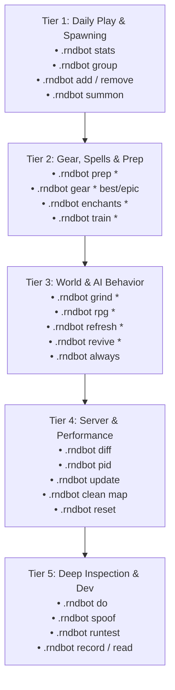

# Tortoise-WoW RandomBot (`.rndbot`) Master Command & Learning Guide

> **Target Core**: Turtle-WoW 1.18.1 (Build 7272) • CMaNGOS + PlayerBots Framework
> **Source Verification**: `src/modules/PlayerBots/playerbot/RandomPlayerbotMgr.cpp` & `PlayerbotMgr.cpp`
> **Security Level**: Available to all players (`SEC_PLAYER` / Level 0) with elevated GM features where noted.
> **Related Portals**: [🏠 Master GM Portal (gm_commands.md)](./gm_commands.md) • [📖 Module 11: Playerbot Suite (references/11_playerbot_suite.md)](./references/11_playerbot_suite.md) • [📖 Module 12: RandomBot Manager (references/12_randombot_manager.md)](./references/12_randombot_manager.md) • [🎯 Bot Whispers & Macros (references/13_bot_whispers_and_macros.md)](./references/13_bot_whispers_and_macros.md)

---

## 🧭 Visual Learning Roadmap: From Beginner to Engine Master

Because `.rndbot` contains dozens of versatile subcommands, use this progressive 5-tier roadmap to learn them naturally:



---

## ⚡ 5-Minute Quick-Start: The 6 Commands You Use 95% of the Time

| Goal | In-Game Command | What Happens |
| :--- | :--- | :--- |
| **1. Check Population** | `.rndbot stats` | Prints total online bots, level brackets, race/class breakdown, and active roles. |
| **2. Instant 5-Man Group** | `.rndbot group` | Auto-creates and groups 4 balanced bots (Tank, Heals, DPS) matching your level. |
| **3. Full Gear & Prep** | `.rndbot prep *` | Instantly equips gear, enchants armor, learns all spells, and stocks food/pots/ammo. |
| **4. Best-in-Slot Epics** | `.rndbot gear * best` | Upgrades all party bots to the highest-stat BiS gear in the database for their level. |
| **5. Pull Bots to You** | `.rndbot summon *` | Teleports all active party bots directly to your feet and resumes follow formation. |
| **6. Unstuck / Refresh** | `.rndbot refresh *` | Soft-reboots all bots, clearing combat deadlocks, pathing loops, and broken states. |

---

## 🎯 Target Wildcards & Scope Syntax

When issuing `.rndbot` commands, you can specify individual bots or broad selectors:

| Selector | Target Scope | Example Usage |
| :---: | :--- | :--- |
| **`<botname>`** | Single specific bot | `.rndbot gear Dunpriest epic` • `.rndbot add Tankman` |
| **`*`** | **All bots in your current party / raid** | `.rndbot prep *` • `.rndbot summon *` • `.rndbot level * 60` |
| **`%`** | **All random bots server-wide** | `.rndbot init %` • `.rndbot refresh %` • `.rndbot grind %` |
| **`%t` / *(no arg)*** | **Your current in-game target** | Target a bot in-game and type `.rndbot gear epic` or `/w %t follow` |
| **`guild`** | All bots in your guild | `.rndbot init guild epic` • `.rndbot prep guild` |
| **`!`** | All loaded bots across the world *(GM only)* | `.rndbot summon !` • `.rndbot gear ! best` |
| **`Name1,Name2`** | Comma-separated list of bots | `.rndbot prep Dunpriest,Tankman,Magedot` |

---

## 📚 Complete `.rndbot` Command Directory (Categorized)

---

### 1. 📊 Realm Telemetry & Population Health

Commands to monitor realm-wide bot density, distribution, and server responsiveness.

#### `.rndbot stats`

- **Description**: Spawns a background worker thread to gather and format complete realm population telemetry.
- **Output Details**:
  - Total random bots online vs registered pool.
  - Alliance vs Horde level distribution in 10-level brackets (`1..9`, `10..19`, ..., `50..59`, `60`).
  - Breakdown across all playable races (including Turtle-WoW custom races like High Elf and Goblin).
  - Class distribution (Warrior, Paladin, Hunter, Rogue, Priest, Shaman, Mage, Warlock, Druid).
  - Combat role distribution (**Tank**, **Healer**, **DPS**).
  - Activity telemetry: **Active** (processing AI decisions), **Moving**, **On mount**, **On taxi/flight**, **In combat**, **Dead/Ghost**, **AFK**.
  - Questing status: **Picking up quests**, **Doing quests**, **Handing in quests**, **Idling**.
- **Syntax**: `.rndbot stats`

#### `.rndbot diff` / `.rndbot diff <player_diff> <empty_diff>`

- **Description**: Displays and configures server tick latency metrics and bot governor thresholds.
- **Output Details**:
  - `Avg diff`: Average millisecond server tick duration over recent window.
  - `Max diff`: Peak tick latency spike recorded.
  - `char db ping`: Latency delay to the `tw_char` Character Database.
  - `Sessions online`: Count of human player sessions.
  - `Bots online`: Total bots online and actively computing AI ticks.
- **Parameter Mode**:
  - `.rndbot diff 100 200` sets target diff to 100ms when human players are present and 200ms when zone is empty.
- **Syntax**: `.rndbot diff` or `.rndbot diff [player_diff] [empty_diff]`

#### `.rndbot pid` / `.rndbot pid <p> <i> <d>`

- **Description**: Displays or tunes the real-time Proportional-Integral-Derivative (PID) dynamic controller that balances bot activity based on server load.
  - *Proportional (Kp)*: Activity throttled based on current diff above/below target.
  - *Integral (Ki)*: Cumulative error correction over time.
  - *Derivative (Kd)*: Reacts to rapid acceleration of tick diff spikes.
- **Syntax**: `.rndbot pid` *(view current)* or `.rndbot pid 0.05 0.001 0.05` *(tune)*

#### `.rndbot update`

- **Description**: Forces an immediate AI update tick across the entire realm (`sRandomPlayerbotMgr.UpdateAIInternal(0)`). Triggers zone population evaluation, quest log checks, and auto-login/logout cycles without waiting for the next timer.
- **Syntax**: `.rndbot update`

#### `.rndbot login debug`

- **Description**: Toggles real-time verbose console logging for the bot login queue manager (`sPlayerBotLoginMgr`). Essential for diagnosing login throttles or database connection locks.
- **Syntax**: `.rndbot login debug`

#### `.rndbot clean map`

- **Description**: Spawns detached threads to unload unreferenced map geometry and VMaps (`WorldPosition::unloadMapAndVMaps`) across all map IDs. Frees memory leaks and cleans orphaned pathfinding grids.
- **Syntax**: `.rndbot clean map`

#### `.rndbot reset`

- **Description**: Wipes all persistent random bot records from the database (`DELETE FROM ai_playerbot_random_bots WHERE event != 'temporary'`) and clears the event cache.
- **Usage Note**: Requires a server restart after execution to regenerate a fresh, balanced bot cohort from scratch.
- **Syntax**: `.rndbot reset`

---

### 2. 👥 Party Generation & Group Management

Commands for rapidly assembling and recruiting bots into your group.

#### `.rndbot group [size=<n>] [level=<n>]`

- **Description**: Automatically queries the LFG role balancer to determine missing group roles, generates complementary bots matching your faction, sets them to your level, learns default spells, initializes talents for their assigned role, and invites them directly to your party.
- **Examples**:
  - `.rndbot group` — Spawns a balanced 5-man dungeon party.
  - `.rndbot group size=3` — Creates a 3-man group.
  - `.rndbot group level=60` — Forces all generated bots to level 60.

#### `.rndbot create level=<n> class=<class> race=<race> [group=<master>] [autoadd=<0|1>] [temporary=<0|1>]`

- **Description**: Crafts a brand-new bot character with explicit specifications, auto-learns spells, auto-selects talent trees, and initializes flight taxi nodes.
- **Examples**:
  - `.rndbot create level=60 class=warrior race=human group=MyCharacter autoadd=1`
  - `.rndbot create level=60 class=priest race=dwarf autoadd=1`

#### `.rndbot add <botname>` / `.rndbot login <botname>`

- **Description**: Brings a specific random bot or account bot online into the world and adds them to your party.
- **Example**: `.rndbot add Dunpriest`

#### `.rndbot remove <botname|*>` / `.rndbot logout <botname|*>` / `.rndbot rm <botname|*>`

- **Description**: Safely dismisses, saves to DB, and logs out the specified bot (or `*` for all group bots).
- **Example**: `.rndbot remove *`

#### `.rndbot delete <botname>`

- **Description**: Instantly logs out and permanently purges the bot character from the database (`Player::DeleteFromDB`).
- **Example**: `.rndbot delete Stuckbot`

#### `.rndbot summon <botname|*>` / `.rndbot recall <botname|*>` / `.rndbot come <botname|*>`

- **Description**: Teleports bot(s) directly to your character's current coordinates, syncs map instance, and resumes follow AI.
- **Example**: `.rndbot summon *`

#### `.rndbot list [filter]`

- **Description**: Lists all active playerbots and random bots currently in world memory, their character class, and online status (`+` prefix).
- **Example**: `.rndbot list Priest`

---

### 3. ⚔️ Gearing, Enchants, Talents & Restocking

Equip and supply your bots with level-scaled items and consumables with zero manual vendor shopping.

#### `.rndbot gear <botname|*> [quality]`

- **Description**: Scans the item database and automatically generates and equips level-scaled gear matching the bot's class and talent spec.
- **Quality Options**:
  - `.rndbot gear * epic` (or `purple`): Full level-scaled Epic gear.
  - `.rndbot gear * rare` (or `blue`): Full level-scaled Rare (blue) gear.
  - `.rndbot gear * uncommon` (or `green`): Full level-scaled Uncommon gear.
  - `.rndbot gear * best`: Absolute highest item-level Best-in-Slot (BiS) items for current level.
  - `.rndbot gear * upgrade`: Replaces only lagging gear slots with upgrades matching current level.
  - `.rndbot gear * sync`: Synchronizes bot equipment to the master's character level.
  - `.rndbot gear * partial`: Upgrades a randomized subset of gear slots.
  - `.rndbot gear *` *(no args)*: Equips standard level-appropriate randomized gear.

#### `.rndbot enchants <botname|*>`

- **Description**: Scans every equipped weapon and armor slot on the bot(s) and applies the highest-tier permanent level-appropriate enchantments (e.g. Crusader, +15 Agility, Spell Power, +4 All Stats, +100 HP).
- **Example**: `.rndbot enchants *`

#### `.rndbot train <botname|*>` / `.rndbot learn <botname|*>`

- **Description**: Teaches all available class spells, ranks, and passive proficiencies up to the bot's current level (`bot->learnClassLevelSpells()`).
- **Example**: `.rndbot train *`

#### `.rndbot prep <botname|*>` / `.rndbot prepare <botname|*>`

- **Description**: **The Master One-Click Restock Command**. Automatically executes gear upgrades, enchants, spell training, food/drinks, healing/mana potions, class reagents, and ammo simultaneously.
- **Example**: `.rndbot prep *`

#### `.rndbot consumes <botname|*>` / `.rndbot consumables <botname|*>`

- **Description**: Generates level-scaled flasks, elixirs, scrolls, bandages, and consumable buffs in the bot's inventory.
- **Example**: `.rndbot consumes *`

#### `.rndbot potions <botname|*>` / `.rndbot pots <botname|*>`

- **Description**: Stocks stacks of level-appropriate Healing Potions and Mana Potions.
- **Example**: `.rndbot potions *`

#### `.rndbot food <botname|*>` / `.rndbot drink <botname|*>`

- **Description**: Stocks stacks of level-appropriate food and water drinks in inventory.
- **Example**: `.rndbot food *`

#### `.rndbot regs <botname|*>` / `.rndbot reg <botname|*>` / `.rndbot reagents <botname|*>`

- **Description**: Stocks all required class reagents:
  - *Priests*: Holy Candles, Sacred Candles
  - *Mages*: Arcane Powder, Teleport/Portal Runes
  - *Druids*: Wild Berries, Wild Thorns, Ironwood Seeds
  - *Warlocks*: Soul Shards
  - *Paladins*: Symbols of Divinity, Symbols of Kings
  - *Shamans*: Ankhs, Fish Oil, Shiny Fish Scales
  - *Rogues*: Flash Powder, Blinding Powder, Thistle Tea
- **Example**: `.rndbot regs *`

#### `.rndbot ammo <botname|*>`

- **Description**: Generates level-appropriate arrows/bullets and equips the best matching quiver/ammo pouch for ranged weapons.
- **Example**: `.rndbot ammo *`

#### `.rndbot pet <botname|*>`

- **Description**: Manages combat pet summoning, feeding, and skill training for Hunters and Warlocks.
- **Example**: `.rndbot pet *`

---

### 4. 🌍 Open-World Activity & Autonomous Behaviors

Control what autonomous bots do when roaming the open world.

#### `.rndbot grind <botname|%>`

- **Description**: Directs bot(s) to mob farming and grinding locations appropriate for their current level.
- **Examples**:
  - `.rndbot grind Dunpriest` — Sends single bot to grind spot.
  - `.rndbot grind %` — Disperses all online random bots across open-world mob camps.

#### `.rndbot rpg <botname|%>`

- **Description**: Teleports bot(s) to taverns, cities, crafting trainers, and quest hubs for RPG social simulation, applying a 10-minute travel cooldown.
- **Examples**:
  - `.rndbot rpg Dunpriest`
  - `.rndbot rpg %`

#### `.rndbot teleport <botname|%>`

- **Description**: Teleports bot(s) to a location suitable for their level.
- **Example**: `.rndbot teleport %`

#### `.rndbot change_strategy <botname|%> [strategy]`

- **Description**: Toggles or randomizes the macro-level state of bot(s) between active grinding/PvP and tavern/RPG visiting.
- **Example**: `.rndbot change_strategy %`

#### `.rndbot refresh <botname|%>`

- **Description**: Cycles logout and login for the bot, wiping transient action queues, resetting stuck movement controllers, restoring health/mana, and re-evaluating surrounding world objects.
- **Example**: `.rndbot refresh %`

#### `.rndbot revive <botname|%>`

- **Description**: Instantly revives dead/ghost bots, clearing spirit walk states and replenishing vital stats.
- **Example**: `.rndbot revive %`

#### `.rndbot init <botname|%> [quality]`

- **Description**: Performs a full re-roll on the bot: randomizes appearance, talents, equips full gear of specified quality, and teaches spells.
- **Example**: `.rndbot init % epic`

---

### 5. 🤖 Character Modes, Offline AI & Self-Bot

#### `.rndbot always <playername>`

- **Description**: Flags a character for **Offline AI**. When enabled, the character remains online in the world as an active bot even when the account owner logs off or disconnects.
- **Example**: `.rndbot always Altpriest`

#### `.rndbot self [login]`

- **Description**: Toggles **Self-Bot Mode** on your currently played character. Hand over full combat, rotation, healing, and pathfinding control to the bot AI engine!
  - Adding `login` persists self-bot mode across subsequent logins.
- **Example**: `.rndbot self`

#### `.rndbot levelup <botname|*> [level]` / `.rndbot level <botname|*> [level]`

- **Description**: Instantly sets the target bot(s) to specified level (or increases level by 1), recalculating base stats, talent points, and taxi flight nodes.
- **Example**: `.rndbot level * 60`

#### `.rndbot random <botname|*>`

- **Description**: Randomizes character appearance (hair style, hair color, facial features, skin tone).
- **Example**: `.rndbot random *`

---

### 6. 🎭 Identity Spoofing & Chat Routing

#### `.rndbot spoof <botname>` / `.rndbot spoof`

- **Description**: Spoofs your sender identity as the specified bot. All subsequent commands, whispers, party chat, and guild chat behave as if sent directly from that bot!
- **Clearing**: Type `.rndbot spoof` with no parameters to clear active spoofing.
- **Example**:

  ```text
  .rndbot spoof Dunpriest
  .rndbot p I will handle primary heals on the tank!
  .rndbot spoof
  ```

#### `.rndbot p [botname] [message]`

- **Description**: Sends a message to party chat as the bot. If no message is provided, displays detailed party status for that bot.
- **Example**: `.rndbot p Dunpriest Buffing Power Word: Fortitude now.`

#### `.rndbot g [botname] [message]`

- **Description**: Sends a message to guild chat as the bot (or displays guild info if no message).
- **Example**: `.rndbot g Dunpriest Ready for Molten Core!`

#### `.rndbot r [botname] [message]`

- **Description**: Sends a message to raid chat as the bot.
- **Example**: `.rndbot r Dunpriest Group 1 healed.`

#### `.rndbot rl [botname]`

- **Description**: Transfers raid leader permissions to the specified bot.
- **Example**: `.rndbot rl Dunpriest`

#### `.rndbot w <botname> <message>` / `.rndbot w <sender> <receiver> <message>`

- **Description**: Directs whisper routing between bots or from a bot to a player.
- **Example**: `.rndbot w Dunpriest follow`

#### `.rndbot c <botname> <command>`

- **Description**: Forces the bot to execute a slash or chat command directly.
- **Example**: `.rndbot c Dunpriest /dance`

---

### 7. ⚡ Synchronous & Asynchronous Action Engine

Deep control to query internal AI states or fire raw action nodes.

#### `.rndbot do <botname> <action>` (Synchronous)

- **Description**: Instantly executes an internal `AiObjectContext` action on the bot synchronously and prints the immediate return value.
- **Useful Actions to Query**:
  - `.rndbot do Dunpriest stats` — Full stat breakdown (Armor, Spell Power, Crit, Defense, Resistances).
  - `.rndbot do Dunpriest where` — Exact map coordinates, zone name, and orientation.
  - `.rndbot do Dunpriest quests` — List of active and completed quests in bot's quest log.
  - `.rndbot do Dunpriest inventory` — List of all bag slots, item IDs, and free space.
  - `.rndbot do Dunpriest who` — Current combat target and threat table.
  - `.rndbot do Dunpriest spells` — List of learned spell ranks.
- **Example**: `.rndbot do Dunpriest stats`

#### `.rndbot cmd <botname> <command>` (Asynchronous)

- **Description**: Dispatches an AI command asynchronously to the bot's external event queue.
- **Example**: `.rndbot cmd Dunpriest reset travel target`

#### `.rndbot record <botname> enable/disable`

- **Description**: Enables or disables output recording buffer for asynchronous bot commands.
- **Example**: `.rndbot record Dunpriest enable`

#### `.rndbot read <botname>`

- **Description**: Reads and displays all captured output messages from the bot's recording buffer.
- **Example**: `.rndbot read Dunpriest`

#### `.rndbot clear <botname>`

- **Description**: Clears the bot's message recording buffer without printing.
- **Example**: `.rndbot clear Dunpriest`

---

### 8. 🧪 Diagnostics & Automated Behavioral Testing

#### `.rndbot debug <botname> <command>`

- **Description**: Executes low-level engine diagnostics on the bot.
- **Examples**:
  - `.rndbot debug Dunpriest position teleport` — Frees stuck bot from mesh collision geometry.
  - `.rndbot debug Dunpriest position route <destination>` — Traces pathfinding navigation route.
  - `.rndbot debug Dunpriest travel target` — Inspects current travel node state.

#### `.rndbot test <botname> <testName>`

- **Description**: Activates a multi-tick behavioral unit test on the specified bot.
- **Examples**:
  - `.rndbot test Dunpriest walk_to_ironforge`
  - `.rndbot test Dunpriest flight_ratchet_to_booty_bay`

#### `.rndbot runtest <testnamepart> [count]` / `.rndbot runtest ? <testnamepart>`

- **Description**: Runs headless automated integration tests against bot modules.
- **Examples**:
  - `.rndbot runtest ? *` — Lists all available test suites in the registry.
  - `.rndbot runtest deadmines 1` — Executes automated Deadmines clear test.

#### `.rndbot reload`

- **Description**: Dynamically reloads `aiplayerbot.conf` settings into memory without dropping player sessions *(GM Security)*.
- **Syntax**: `.rndbot reload`

#### `.rndbot tweak`

- **Description**: Cycles the AI heuristic tweak counter (0, 1, 2) for runtime performance experiments *(GM Security)*.
- **Syntax**: `.rndbot tweak`

---

## 🗂️ Categorized In-Game Macro Book (`/m`)

Copy and paste these macros directly into your World of Warcraft **Macro UI** (`/m`):

### 🌟 Macro Card 1: 1-Click Level 60 Dungeon Party (Spawn + BiS Gear + Enchants + Prep)

```lua
.rndbot group
.rndbot level * 60
.rndbot gear * best
.rndbot enchants *
.rndbot train *
.rndbot prep *
.rndbot summon *
/p follow
```

### 🛡️ Macro Card 2: Restock All Party Consumables, Pots, Reagents & Ammo

```lua
.rndbot prep *
.rndbot food *
.rndbot potions *
.rndbot regs *
.rndbot ammo *
```

### 🔄 Macro Card 3: Mass Realm Population Unstuck & Refresh

```lua
.rndbot refresh %
.rndbot revive %
.rndbot update
```

### 🌍 Macro Card 4: Disperse World Population (Grind + RPG)

```lua
.rndbot grind %
.rndbot update
```

### 📊 Macro Card 5: Full Performance & Telemetry Audit

```lua
.rndbot stats
.rndbot diff
.rndbot pid
```

---

## 📋 `.rndbot` vs `.bot` Quick Reference

| Feature | `.rndbot` | `.bot` |
| :--- | :--- | :--- |
| **Primary Scope** | Autonomous world population & server management | Personal party bots & alt characters |
| **World Wildcard (`%`)** | Supported (`.rndbot refresh %`) | Not supported (uses `*` for party) |
| **Telemetry (`stats`/`diff`/`pid`)** | Supported | Not supported |
| **Auto 5-Man Group (`group`)** | Supported (`.rndbot group`) | Supported (`.bot group`) |
| **Gearing (`gear best/epic`)** | Supported (`.rndbot gear * best`) | Supported (`.bot gear * best`) |
| **Sync Actions (`do <action>`)** | Supported (`.rndbot do <bot> stats`) | Supported (`.bot do <bot> stats`) |
| **Identity Spoofing (`spoof`)** | Supported (`.rndbot spoof <bot>`) | Supported (`.bot spoof <bot>`) |
| **Map Cleanup (`clean map`)** | Supported (`.rndbot clean map`) | Not supported |

---

<p align="center">
  [🏠 Master GM Portal (gm_commands.md)](./gm_commands.md) • [📖 Module 11: Playerbot Suite](./references/11_playerbot_suite.md) • [📖 Module 12: RandomBot Manager](./references/12_randombot_manager.md) • [🎯 Bot Whispers & Macros](./references/13_bot_whispers_and_macros.md)
</p>
